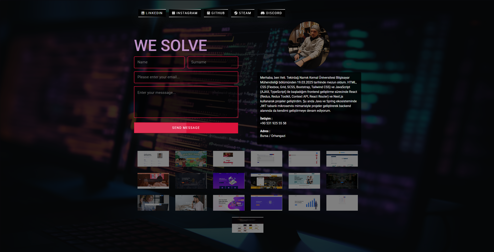

# 🌐 Personal Portfolio Website

A personal portfolio website created to showcase projects, skills, and contact information.

The project focuses on **SCSS architecture and responsive design**.

## 🚀 Features

- About section
- Projects showcase
- Skills section
- Contact section
- Responsive design

## 🛠️ Technologies Used

- HTML
- SCSS (Sass)
- CSS
- JavaScript

## 📂 Project Structure

```
PersonalSite-SCSS
 ├── index.html
 ├── scss/
 ├── css/
 └── img/
```

## ⚙️ Installation

Clone the repository

```
git clone https://github.com/velidogan120/PersonalSite-SCSS.git
```

Compile SCSS

```
npm install
npm run sass
```

Open `index.html`.

## 🎯 Purpose

This project was created to practice:

- SCSS structure
- Responsive design
- Portfolio website development
- Clean UI design

## 📸 Screenshots

<p>
  
</p>

## 👨‍💻 Author

Veli Doğan
https://github.com/velidogan120
